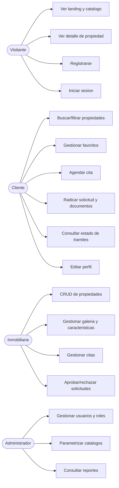

# Casos de Uso - JSGE In-Mobiliaria

Documento de casos de uso del sistema, agrupados por actor. Complementa al
[modelo de datos](modelo_datos.md) y a la planificación Scrum (`sprint*_planning.md`).

## Actores

| Actor | Descripción |
|-------|-------------|
| **Visitante** | Usuario no autenticado. Navega la landing, el catálogo y el detalle público. |
| **Cliente** | Usuario autenticado que busca, marca favoritos, agenda citas y radica solicitudes. |
| **Inmobiliaria (Agente)** | Publica propiedades, gestiona citas y aprueba solicitudes/documentos. |
| **Administrador** | Acceso total: usuarios, roles, catálogos y reportes. |

## Diagrama general (Mermaid)

---

## CU-01 Registro de usuario

- **Actor:** Visitante.
- **Precondición:** No estar autenticado.
- **Flujo principal:**
  1. El visitante abre el formulario de registro.
  2. Ingresa correo, contraseña, nombres, apellidos y documento.
  3. El sistema valida formato de correo y longitud de contraseña (≥ 6).
  4. Cifra la contraseña con BCrypt y crea `usuario` + `perfil` + `usuario_rol` (CLIENTE) en una transacción.
  5. Redirige al login con mensaje de éxito.
- **Flujo alterno:** correo o documento duplicado → mensaje amigable (restricción UNIQUE).
- **Postcondición:** Usuario registrado con rol CLIENTE.

## CU-02 Inicio y cierre de sesión

- **Actor:** Usuario registrado.
- **Flujo principal:**
  1. Ingresa correo y contraseña.
  2. El sistema valida con `BCrypt.checkpw` contra la base de datos.
  3. Verifica que la cuenta esté activa.
  4. Crea `HttpSession` con `idUsuario`, `correo` y `rol`.
  5. Redirige al panel según el rol.
- **Flujo alterno:** credenciales inválidas o cuenta bloqueada → mensaje de error.
- **Postcondición:** Sesión activa; el cierre de sesión la invalida.

## CU-03 Control de acceso por rol

- **Actor:** Cualquiera.
- **Flujo principal:** el `AuthFilter` intercepta `/dashboard/*` y valida sesión y rol.
- **Flujo alterno:** sin sesión → login; rol insuficiente → `acceso_denegado.jsp`.
- **Regla:** la validación se hace en el servidor; ocultar opciones en la vista no basta.

## CU-04 Gestión de propiedades (CRUD + baja lógica)

- **Actor:** Inmobiliaria.
- **Flujo principal:**
  1. Crea/edita una propiedad (matrícula única, tipo, ciudad, precio, etc.).
  2. Adjunta imágenes (1:N) y características (N:M) en una transacción.
  3. Lista sus propiedades activas.
  4. Da de baja un inmueble (baja lógica `estado_logico = FALSE`, no borrado físico).
- **Flujo alterno:** matrícula duplicada → mensaje amigable.
- **Postcondición:** catálogo actualizado.

## CU-05 Búsqueda y filtrado de propiedades

- **Actor:** Visitante / Cliente.
- **Flujo principal:** filtra por ciudad, tipo, precio (mín/máx), **característica** y palabra clave.
- **Postcondición:** lista de propiedades activas que cumplen los filtros.

## CU-06 Favoritos

- **Actor:** Cliente.
- **Flujo principal:** desde el detalle marca/desmarca una propiedad como favorita.
- **Postcondición:** relación registrada en `favorito`; visible en "Mis Favoritos".

## CU-07 Agendamiento de visitas (citas)

- **Actor:** Cliente.
- **Precondición:** sesión de cliente; propiedad activa.
- **Flujo principal:**
  1. En el detalle abre "Agendar visita".
  2. Indica fecha (no anterior a hoy) y hora.
  3. El sistema registra la cita en estado PENDIENTE.
- **Flujo alterno:** ya existe una visita para esa propiedad en esa fecha/hora → mensaje (UNIQUE).

## CU-08 Gestión de citas

- **Actor:** Inmobiliaria.
- **Flujo principal:** revisa las citas recibidas y cambia su estado
  (PENDIENTE → CONFIRMADA → REALIZADA, o CANCELADA).

## CU-09 Radicación de solicitud de compra/arriendo con documentos

- **Actor:** Cliente.
- **Flujo principal:**
  1. En el detalle abre "Solicitar compra / arriendo" y elige tipo (COMPRA/ARRIENDO) y monto.
  2. El sistema crea la `solicitud` en estado PENDIENTE.
  3. El cliente radica documentos (tipo, nombre, URL) en `documento_solicitud`.
  4. Consulta el estado de sus trámites.
- **Flujo alterno:** la solicitud ya fue resuelta → no admite más documentos; el cliente puede cancelar mientras esté pendiente/en revisión.

## CU-10 Aprobación o rechazo de solicitudes

- **Actor:** Inmobiliaria.
- **Flujo principal:**
  1. Revisa las solicitudes de sus propiedades y los documentos radicados.
  2. Cambia el estado a EN_REVISION, APROBADA o RECHAZADA, con observación.
- **Postcondición:** el cliente ve el nuevo estado y la observación.

## CU-11 Gestión de usuarios y roles

- **Actor:** Administrador.
- **Flujo principal:** lista usuarios, cambia su rol, bloquea/activa cuentas.
- **Restricción:** no puede cambiar su propio rol ni bloquear su cuenta.

## CU-12 Parametrización de catálogos

- **Actor:** Administrador.
- **Flujo principal:** CRUD de ciudades (con departamento), tipos de propiedad y características.
- **Flujo alterno:** nombre duplicado o catálogo en uso → mensaje amigable.

## CU-13 Reportes

- **Actor:** Administrador.
- **Flujo principal:** consulta reportes construidos con JOIN y agregación:
  propiedades con su inmobiliaria, propiedades sin imágenes, propiedades por ciudad,
  **citas por estado**, **solicitudes por inmobiliaria** y propiedades por estado.

## CU-14 Perfil de usuario (1:1)

- **Actor:** Cliente / Inmobiliaria / Administrador.
- **Flujo principal:** actualiza nombres, apellidos, documento, teléfono y dirección.
- **Flujo alterno:** documento duplicado → mensaje amigable.
