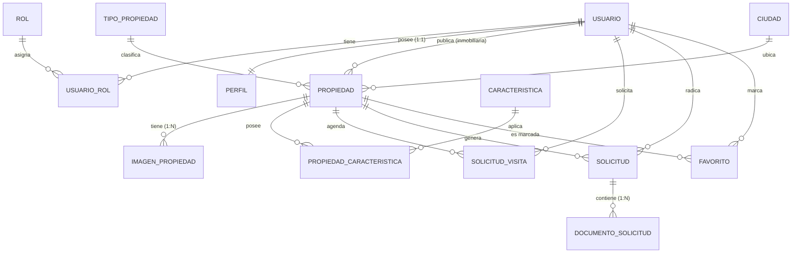

# Modelo de Datos - JSGE In-Mobiliaria

Documento de diseño de la base de datos relacional del sistema `inmobiliaria`
(MySQL / MariaDB), normalizado hasta **Tercera Forma Normal (3FN)**.

- **Motor:** MySQL / MariaDB (instancia local XAMPP y en línea Clever Cloud).
- **Acceso:** JDBC con `PreparedStatement` (clase `ConexionDB` + patrón DAO).
- **Total de tablas:** 14.

---

## 1. Modelo Entidad-Relación (MER)



> Si la herramienta no renderiza Mermaid, el diagrama se puede ver/exportar en
> [https://mermaid.live](https://mermaid.live) pegando el bloque anterior
> (exportar como PNG/PDF para el entregable).

---

## 2. Modelo Relacional (3FN)

Notación: **PK** = llave primaria, **FK** = llave foránea, **UQ** = restricción UNIQUE.

```
rol                     (id_rol PK, nombre UQ)
usuario                 (id_usuario PK, correo UQ, password_hash, estado, fecha_registro)
usuario_rol             (id_usuario PK/FK->usuario, id_rol PK/FK->rol, fecha_asignacion)
perfil                  (id_perfil PK, id_usuario UQ/FK->usuario, nombres, apellidos,
                         documento UQ, telefono, direccion, foto_url, fecha_actualizacion)
tipo_propiedad          (id_tipo PK, nombre UQ)
ciudad                  (id_ciudad PK, nombre UQ, departamento)
propiedad               (id_propiedad PK, matricula_inmobiliaria UQ, titulo, descripcion,
                         precio, habitaciones, banos, area_m2, direccion, estado_logico,
                         id_inmobiliaria FK->usuario, id_tipo FK->tipo_propiedad,
                         id_ciudad FK->ciudad, fecha_publicacion)
imagen_propiedad        (id_imagen PK, id_propiedad FK->propiedad, url_imagen, es_principal)
caracteristica          (id_caracteristica PK, nombre UQ)
propiedad_caracteristica(id_propiedad PK/FK->propiedad,
                         id_caracteristica PK/FK->caracteristica)
solicitud_visita        (id_solicitud PK, id_propiedad FK->propiedad, id_cliente FK->usuario,
                         fecha_visita, hora_visita, comentario, estado, fecha_creacion,
                         UQ(id_propiedad, fecha_visita, hora_visita))
favorito                (id_usuario PK/FK->usuario, id_propiedad PK/FK->propiedad, fecha_agregado)
solicitud               (id_solicitud PK, id_propiedad FK->propiedad, id_cliente FK->usuario,
                         tipo, monto_oferta, mensaje, estado, observacion,
                         fecha_creacion, fecha_actualizacion)
documento_solicitud     (id_documento PK, id_solicitud FK->solicitud,
                         tipo, nombre, url_documento, fecha_carga)
```

---

## 3. Relaciones exigidas y su materialización

### 3.1 Relación Uno a Uno (1:1)
- **`usuario` ↔ `perfil`.** `usuario` guarda credenciales y estado; `perfil` guarda los
  datos personales. La cardinalidad se garantiza declarando
  **`perfil.id_usuario` como UNIQUE**, de modo que un usuario no puede tener dos perfiles.

### 3.2 Relaciones Uno a Muchos (1:N)
- **`usuario` (inmobiliaria) → `propiedad`.** FK `propiedad.id_inmobiliaria`.
- **`propiedad` → `imagen_propiedad`.** FK `imagen_propiedad.id_propiedad`
  (`ON DELETE CASCADE`).
- **`propiedad` → `solicitud_visita`** y **`usuario` → `solicitud_visita`.**
  FK `id_propiedad` e `id_cliente`.
- **`propiedad` → `solicitud`** y **`usuario` → `solicitud`.** FK `id_propiedad`, `id_cliente`.
- **`solicitud` → `documento_solicitud`.** FK `documento_solicitud.id_solicitud`
  (`ON DELETE CASCADE`).

Acciones referenciales: `ON DELETE CASCADE` cuando el hijo no tiene sentido sin el padre
(imágenes, documentos, filas de relación); `ON DELETE RESTRICT` en catálogos
(`tipo_propiedad`, `ciudad`) para impedir borrar un catálogo en uso.

### 3.3 Relaciones Muchos a Muchos (N:M)
- **`usuario` ↔ `rol`** mediante **`usuario_rol`** (PK compuesta
  `id_usuario + id_rol`, atributo propio `fecha_asignacion`).
- **`propiedad` ↔ `caracteristica`** mediante **`propiedad_caracteristica`** (PK compuesta).
- **`usuario` ↔ `propiedad`** mediante **`favorito`** (PK compuesta, atributo `fecha_agregado`).

---

## 4. Restricciones UNIQUE (capturadas en la aplicación)

| Tabla.campo | Motivo |
|-------------|--------|
| `usuario.correo` | Credencial de ingreso irrepetible |
| `propiedad.matricula_inmobiliaria` | Evita publicaciones duplicadas |
| `perfil.id_usuario` | Sostiene la relación 1:1 |
| `perfil.documento` | Evita documentos repetidos entre cuentas |
| `usuario_rol (id_usuario, id_rol)` | Evita roles repetidos (N:M) |
| `propiedad_caracteristica (id_propiedad, id_caracteristica)` | Evita N:M duplicada |
| `favorito (id_usuario, id_propiedad)` | Evita favoritos duplicados |
| `rol.nombre`, `tipo_propiedad.nombre`, `ciudad.nombre`, `caracteristica.nombre` | Catálogos |
| `solicitud_visita (id_propiedad, fecha_visita, hora_visita)` | Evita cruces de agenda |

La aplicación captura la `SQLException` de UNIQUE y muestra un mensaje amigable
(por ejemplo: *"el correo ya se encuentra registrado"*, *"la matrícula ya está registrada"*).

---

## 5. Diccionario de Datos

### 5.1 `rol`
| Columna | Tipo | Restricciones | Descripción |
|---------|------|---------------|-------------|
| id_rol | INT | PK, AUTO_INCREMENT | Identificador del rol |
| nombre | VARCHAR(50) | NOT NULL, UNIQUE | ADMINISTRADOR / INMOBILIARIA / CLIENTE |

### 5.2 `usuario`
| Columna | Tipo | Restricciones | Descripción |
|---------|------|---------------|-------------|
| id_usuario | INT | PK, AUTO_INCREMENT | Identificador |
| correo | VARCHAR(100) | NOT NULL, UNIQUE | Credencial de ingreso |
| password_hash | VARCHAR(255) | NOT NULL | Contraseña cifrada con BCrypt |
| estado | BOOLEAN | DEFAULT TRUE | Cuenta activa/bloqueada |
| fecha_registro | DATETIME | DEFAULT CURRENT_TIMESTAMP | Fecha de alta |

### 5.3 `perfil`
| Columna | Tipo | Restricciones | Descripción |
|---------|------|---------------|-------------|
| id_perfil | INT | PK, AUTO_INCREMENT | Identificador |
| id_usuario | INT | NOT NULL, UNIQUE, FK→usuario | Relación 1:1 |
| nombres | VARCHAR(100) | NOT NULL | Nombres |
| apellidos | VARCHAR(100) | NOT NULL | Apellidos |
| documento | VARCHAR(20) | NOT NULL, UNIQUE | Documento de identidad |
| telefono | VARCHAR(20) | | Teléfono |
| direccion | VARCHAR(150) | | Dirección |
| foto_url | VARCHAR(255) | | Foto de perfil |
| fecha_actualizacion | DATETIME | ON UPDATE | Última actualización |

### 5.4 `usuario_rol`
| Columna | Tipo | Restricciones | Descripción |
|---------|------|---------------|-------------|
| id_usuario | INT | PK, FK→usuario | Usuario |
| id_rol | INT | PK, FK→rol | Rol asignado |
| fecha_asignacion | DATETIME | DEFAULT CURRENT_TIMESTAMP | Fecha de asignación |

### 5.5 `tipo_propiedad`
| Columna | Tipo | Restricciones | Descripción |
|---------|------|---------------|-------------|
| id_tipo | INT | PK, AUTO_INCREMENT | Identificador |
| nombre | VARCHAR(50) | NOT NULL, UNIQUE | Casa, Apartamento, Local, Oficina, Terreno |

### 5.6 `ciudad`
| Columna | Tipo | Restricciones | Descripción |
|---------|------|---------------|-------------|
| id_ciudad | INT | PK, AUTO_INCREMENT | Identificador |
| nombre | VARCHAR(80) | NOT NULL, UNIQUE | Nombre de la ciudad |
| departamento | VARCHAR(80) | | Departamento |

### 5.7 `propiedad`
| Columna | Tipo | Restricciones | Descripción |
|---------|------|---------------|-------------|
| id_propiedad | INT | PK, AUTO_INCREMENT | Identificador |
| matricula_inmobiliaria | VARCHAR(50) | NOT NULL, UNIQUE | Matrícula única |
| titulo | VARCHAR(150) | NOT NULL | Título |
| descripcion | TEXT | | Descripción |
| precio | DECIMAL(14,2) | NOT NULL | Precio |
| habitaciones | INT | NOT NULL, DEFAULT 0 | Habitaciones |
| banos | INT | NOT NULL, DEFAULT 0 | Baños |
| area_m2 | DECIMAL(10,2) | NOT NULL | Área en m² |
| direccion | VARCHAR(180) | | Dirección |
| estado_logico | BOOLEAN | DEFAULT TRUE | Baja lógica (TRUE=activa) |
| id_inmobiliaria | INT | NOT NULL, FK→usuario | Inmobiliaria dueña |
| id_tipo | INT | NOT NULL, FK→tipo_propiedad | Tipo |
| id_ciudad | INT | NOT NULL, FK→ciudad | Ciudad |
| fecha_publicacion | DATETIME | DEFAULT CURRENT_TIMESTAMP | Publicación |

### 5.8 `imagen_propiedad`
| Columna | Tipo | Restricciones | Descripción |
|---------|------|---------------|-------------|
| id_imagen | INT | PK, AUTO_INCREMENT | Identificador |
| id_propiedad | INT | NOT NULL, FK→propiedad | Propiedad (1:N) |
| url_imagen | VARCHAR(500) | NOT NULL | URL de la imagen |
| es_principal | BOOLEAN | DEFAULT FALSE | Imagen principal |

### 5.9 `caracteristica`
| Columna | Tipo | Restricciones | Descripción |
|---------|------|---------------|-------------|
| id_caracteristica | INT | PK, AUTO_INCREMENT | Identificador |
| nombre | VARCHAR(80) | NOT NULL, UNIQUE | Piscina, Parqueadero, etc. |

### 5.10 `propiedad_caracteristica`
| Columna | Tipo | Restricciones | Descripción |
|---------|------|---------------|-------------|
| id_propiedad | INT | PK, FK→propiedad | Propiedad |
| id_caracteristica | INT | PK, FK→caracteristica | Característica |

### 5.11 `solicitud_visita` (cita)
| Columna | Tipo | Restricciones | Descripción |
|---------|------|---------------|-------------|
| id_solicitud | INT | PK, AUTO_INCREMENT | Identificador |
| id_propiedad | INT | NOT NULL, FK→propiedad | Propiedad |
| id_cliente | INT | NOT NULL, FK→usuario | Cliente |
| fecha_visita | DATE | NOT NULL | Fecha de la visita |
| hora_visita | TIME | NOT NULL | Hora de la visita |
| comentario | VARCHAR(500) | | Comentario |
| estado | VARCHAR(20) | NOT NULL, DEFAULT 'PENDIENTE' | PENDIENTE/CONFIRMADA/CANCELADA/REALIZADA |
| fecha_creacion | DATETIME | DEFAULT CURRENT_TIMESTAMP | Alta |
| (id_propiedad, fecha_visita, hora_visita) | | UNIQUE | Evita cruces de agenda |

### 5.12 `favorito`
| Columna | Tipo | Restricciones | Descripción |
|---------|------|---------------|-------------|
| id_usuario | INT | PK, FK→usuario | Usuario |
| id_propiedad | INT | PK, FK→propiedad | Propiedad favorita |
| fecha_agregado | DATETIME | DEFAULT CURRENT_TIMESTAMP | Fecha |

### 5.13 `solicitud` (trámite de compra/arriendo)
| Columna | Tipo | Restricciones | Descripción |
|---------|------|---------------|-------------|
| id_solicitud | INT | PK, AUTO_INCREMENT | Identificador |
| id_propiedad | INT | NOT NULL, FK→propiedad | Propiedad |
| id_cliente | INT | NOT NULL, FK→usuario | Cliente |
| tipo | VARCHAR(20) | NOT NULL, DEFAULT 'COMPRA' | COMPRA / ARRIENDO |
| monto_oferta | DECIMAL(14,2) | | Monto ofertado (opcional) |
| mensaje | VARCHAR(500) | | Mensaje del cliente |
| estado | VARCHAR(20) | NOT NULL, DEFAULT 'PENDIENTE' | PENDIENTE/EN_REVISION/APROBADA/RECHAZADA/CANCELADA |
| observacion | VARCHAR(500) | | Respuesta de la inmobiliaria |
| fecha_creacion | DATETIME | DEFAULT CURRENT_TIMESTAMP | Alta |
| fecha_actualizacion | DATETIME | ON UPDATE | Última gestión |

### 5.14 `documento_solicitud`
| Columna | Tipo | Restricciones | Descripción |
|---------|------|---------------|-------------|
| id_documento | INT | PK, AUTO_INCREMENT | Identificador |
| id_solicitud | INT | NOT NULL, FK→solicitud | Solicitud (1:N) |
| tipo | VARCHAR(50) | | CEDULA/INGRESOS/ESCRITURA/... |
| nombre | VARCHAR(150) | NOT NULL | Nombre del documento |
| url_documento | VARCHAR(500) | NOT NULL | URL del documento |
| fecha_carga | DATETIME | DEFAULT CURRENT_TIMESTAMP | Fecha de radicación |

---

## 6. Consultas obligatorias (JOIN y agregación)

Todas implementadas con `PreparedStatement` en la capa DAO.

1. **INNER JOIN de 4 tablas** — `ReporteDAO.listarPropiedadesConInmobiliaria()`
   (`propiedad` + `tipo_propiedad` + `ciudad` + `usuario`).
2. **INNER JOIN de 3+ tablas** — `SolicitudDAO.SELECT_BASE`
   (`solicitud` + `propiedad` + `ciudad` + `usuario` + `perfil`).
3. **Relación N:M** — `CaracteristicaDAO.listarPorPropiedad()`
   (`caracteristica` + `propiedad_caracteristica`).
4. **LEFT JOIN** — `ReporteDAO.listarPropiedadesSinImagenes()`
   (`propiedad` LEFT JOIN `imagen_propiedad`).
5. **GROUP BY + HAVING** — `ReporteDAO.contarPropiedadesPorCiudad()`
   (ciudades con 2 o más propiedades activas).
6. **GROUP BY (reportes adicionales)** — `contarCitasPorEstado()`,
   `listarSolicitudesPorInmobiliaria()`, `contarPropiedadesPorEstado()`.

Ejemplo (reporte de solicitudes por inmobiliaria):

```sql
SELECT u.correo AS etiqueta, COUNT(s.id_solicitud) AS total
FROM solicitud s
INNER JOIN propiedad p ON s.id_propiedad = p.id_propiedad
INNER JOIN usuario u   ON p.id_inmobiliaria = u.id_usuario
GROUP BY u.id_usuario, u.correo
ORDER BY total DESC;
```

---

## 7. Normalización (justificación 3FN)

- **1FN:** Todos los atributos son atómicos (no hay listas ni campos multivaluados);
  las imágenes y características se separan en tablas propias.
- **2FN:** En las tablas con PK compuesta (`usuario_rol`, `propiedad_caracteristica`,
  `favorito`) no existen dependencias parciales: todos los atributos dependen de la
  clave completa.
- **3FN:** No hay dependencias transitivas. Los catálogos (`tipo_propiedad`, `ciudad`,
  `caracteristica`, `rol`) se almacenan una sola vez y se referencian por FK; los datos
  descriptivos (nombre de tipo, nombre de ciudad) no se repiten en `propiedad`.
