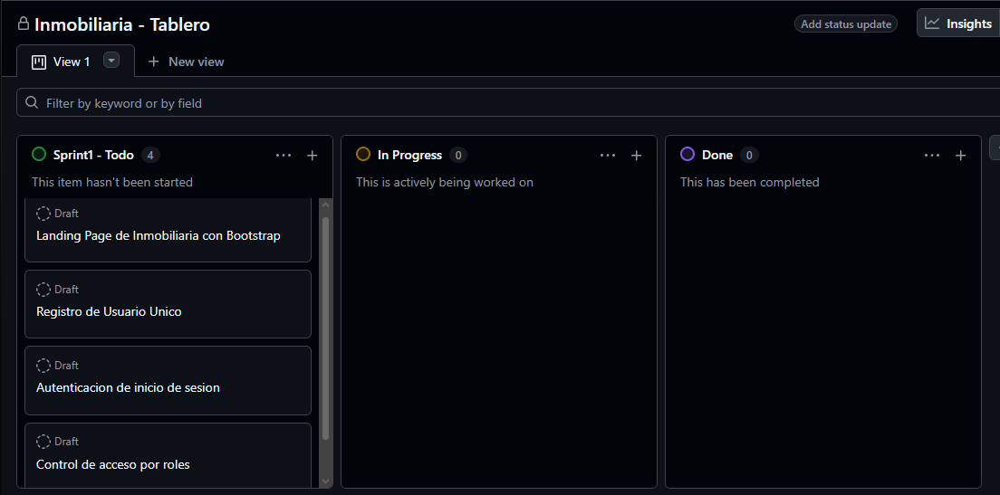

# Planificación Sprint 1 - Cimientos y Acceso

- **Metodología:** Scrum
- **Duración:** 7 días
- **Objetivo del Sprint:** Diseñar el modelo de datos relacional base (3FN), la conexión JDBC centralizada, la landing page pública y la autenticación de usuarios con cifrado de contraseñas y control de acceso mediante Filtros de Servlet.

---

## Roles Scrum
- **Product Owner:** Julian Barney Jaimes Rincon (Docente)
- **Scrum Master:** Jhoan Santiago Garcia Estupiñan
- **Development Team:** Jhoan Santiago Garcia Estupiñan

---

## Historias de Usuario Seleccionadas (Sprint Backlog)

### HU-1: Landing Page Pública
- **Como:** Visitante
- **Quiero:** Navegar por una página de inicio responsiva para conocer la inmobiliaria y acceder al catálogo general.
- **Criterios de Aceptación (DoD):**
  - [ ] Diseño adaptable mediante Bootstrap.
  - [ ] Enlaces visibles para acceso a Login y Registro.
  - [ ] Despliegue funcional desde `index.jsp` en Apache Tomcat.

### HU-2: Registro de Usuarios
- **Como:** Usuario no registrado
- **Quiero:** Registrarme con mis datos personales y un correo único.
- **Criterios de Aceptación (DoD):**
  - [ ] La contraseña se encripta mediante hash (BCrypt o SHA-256 con salt) antes de guardarse en la BD.
  - [ ] La aplicación captura la excepción del campo UNIQUE (`usuario.correo`) y muestra un mensaje amigable al usuario en lugar de un error de Java.

### HU-3: Autenticación e Inicio de Sesión
- **Como:** Usuario registrado
- **Quiero:** Iniciar y cerrar sesión de forma segura.
- **Criterios de Aceptación (DoD):**
  - [ ] Validación de credenciales contra la base de datos.
  - [ ] Objeto `HttpSession` almacena el ID del usuario y su rol.
  - [ ] Opción de cierre de sesión que invalida la sesión HTTP actual.

### HU-4: Control de Acceso por Roles (Filtro Servlet)
- **Como:** Administrador del sistema
- **Quiero:** Restringir el acceso a rutas privadas en el servidor según el rol.
- **Criterios de Aceptación (DoD):**
  - [ ] Implementación de un `Filter` en Servlets que valide la sesión y el rol del usuario.
  - [ ] Redirección automática a página de acceso denegado si intenta ingresar escribiendo la URL directamente sin permisos.

  ## Evidencia del Tablero Kanban

---

## Sprint Review (Sprint 1)

- **Incremento demostrado:** landing page pública responsiva, registro de usuarios con
  correo único y contraseña cifrada (BCrypt), inicio/cierre de sesión y control de
  acceso por roles mediante `AuthFilter`.
- **Historias aceptadas:** HU-01 (landing), HU-02 (registro), HU-03 (login), HU-04 (filtro de roles).
- **Criterios de aceptación:** cumplidos; el sistema redirige al panel según el rol y
  bloquea el acceso directo por URL a rutas no autorizadas.
- **Feedback del Product Owner:** continuar con el CRUD de propiedades y las relaciones
  del modelo de datos (1:N y N:M).

## Sprint Retrospective (Sprint 1)

- **Qué funcionó bien:** la separación MVC y el hashing con BCrypt.
- **Qué mejorar:** centralizar la configuración de conexión y documentar el tablero.
- **Acciones para el Sprint 2:** implementar transacciones JDBC para las relaciones
  N:M y reutilizar `header.jsp` para la navegación dinámica por rol.
