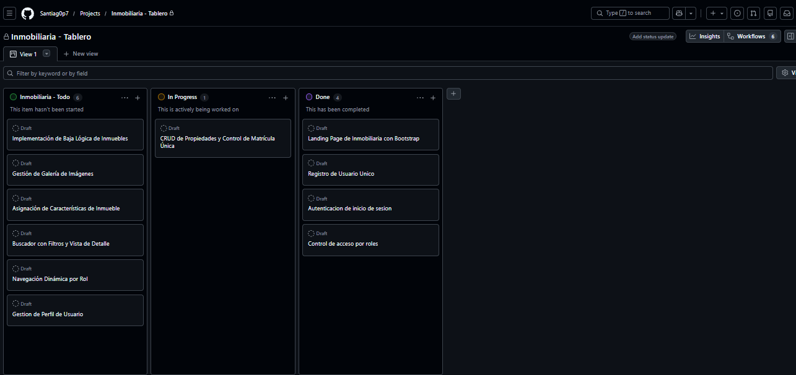

# Planificación Sprint 2 - Núcleo del Negocio y Experiencia de Usuario

- **Metodología:** Scrum
- **Duración:** 7 días
- **Estado:** ✅ COMPLETADO (100%)
- **Objetivo del Sprint:** Implementar el núcleo operativo del negocio inmobiliario: CRUD completo de propiedades con control de matrícula única, baja lógica, galería de imágenes (1:N), asignación transaccional de características (N:M), buscador público con filtros y ficha de detalle, además de la navegación dinámica por rol y la gestión del perfil de usuario (1:1).

---

## Roles Scrum
- **Product Owner:** Julian Barney Jaimes Rincon (Docente)
- **Scrum Master:** Jhoan Santiago Garcia Estupiñan
- **Development Team:** Jhoan Santiago Garcia Estupiñan

---

## Resumen del Sprint Backlog

| ID | Historia de Usuario | Épica | Estado |
|----|---------------------|-------|--------|
| HU-05 | CRUD Completo de Propiedades y Control de Matrícula Única | Gestión de Inmuebles | ✅ COMPLETADO |
| HU-06 | Implementación de Baja Lógica (`estado_logico = FALSE`) | Gestión de Inmuebles | ✅ COMPLETADO |
| HU-07 | Gestión de Galería de Imágenes (Relación 1:N) | Multimedia | ✅ COMPLETADO |
| HU-08 | Asignación Transaccional de Características (Relación N:M) | Modelo de Datos | ✅ COMPLETADO |
| HU-09 | Buscador de Catálogo con Filtros y Ficha de Detalle | Catálogo Público | ✅ COMPLETADO |
| HU-10 | Navegación Dinámica por Rol y Perfil de Usuario (1:1) | Seguridad y Perfil | ✅ COMPLETADO |

---

## Historias de Usuario Seleccionadas (Sprint Backlog)

### HU-05: CRUD Completo de Propiedades y Control de Matrícula Única
- **Como:** Agente inmobiliario
- **Quiero:** Crear, leer, actualizar y eliminar propiedades con control de matrícula única.
- **Criterios de Aceptación (DoD):**
  - [x] Formulario de registro de propiedad con validación de campos obligatorios.
  - [x] Control de matrícula única mediante constraint `UNIQUE` en la base de datos.
  - [x] Captura de la excepción por matrícula duplicada con mensaje amigable al usuario.
  - [x] Listado de propiedades con opción de edición y eliminación.
  - [x] Despliegue funcional desde `dashboard/agente/formulario_propiedad.jsp`.
- **Implementación:**
  - Controlador: `PropiedadServlet` (mapeado a `/PropiedadServlet`, acciones `list`, `new`, `edit`, `delete`).
  - DAO: `PropiedadDAO` con `PreparedStatement` y transacciones JDBC.
  - Restricción en base de datos:
    ```sql
    matricula_inmobiliaria VARCHAR(50) NOT NULL UNIQUE
    ```

### HU-06: Implementación de Baja Lógica de Inmuebles
- **Como:** Agente inmobiliario
- **Quiero:** Desactivar propiedades sin eliminarlas físicamente de la base de datos.
- **Criterios de Aceptación (DoD):**
  - [x] Campo `estado_logico` en la tabla `propiedad` para el control de baja lógica.
  - [x] Las propiedades desactivadas no aparecen en el catálogo público.
  - [x] El agente puede reactivar una propiedad desactivada desde su panel.
  - [x] Cambio de estado visible en el listado de propiedades del agente.
- **Implementación:**
  - Columna booleana y filtro persistente en las consultas del catálogo:
    ```sql
    estado_logico BOOLEAN DEFAULT TRUE, -- TRUE=activa, FALSE=eliminada
    ```
    ```sql
    WHERE p.estado_logico = TRUE
    ```

### HU-07: Gestión de Galería de Imágenes
- **Como:** Agente inmobiliario
- **Quiero:** Subir y gestionar múltiples imágenes para cada propiedad.
- **Criterios de Aceptación (DoD):**
  - [x] Capacidad de subir múltiples imágenes por propiedad.
  - [x] Almacenamiento de la URL de cada imagen (relación 1:N).
  - [x] Visualización de imágenes en la galería y en el detalle de la propiedad.
  - [x] Opción de eliminar imágenes individuales de la galería.
  - [x] Despliegue funcional desde `dashboard/agente/galeria_propiedad.jsp`.
- **Implementación:**
  - DAO: `ImagenPropiedadDAO` (inserción masiva con `setAutoCommit(false)`, `commit()` y `rollback()`).
  - Relación 1:N definida en `db/sprints/sprint2.sql`:
    ```sql
    CREATE TABLE imagen_propiedad (
        id_imagen    INT AUTO_INCREMENT PRIMARY KEY,
        id_propiedad INT NOT NULL,
        url_imagen   VARCHAR(500) NOT NULL,
        es_principal BOOLEAN DEFAULT FALSE,
        FOREIGN KEY (id_propiedad) REFERENCES propiedad(id_propiedad) ON DELETE CASCADE
    );
    ```

### HU-08: Asignación Transaccional de Características
- **Como:** Agente inmobiliario
- **Quiero:** Asociar características (piscina, parqueadero, etc.) a cada propiedad.
- **Criterios de Aceptación (DoD):**
  - [x] Tabla intermedia N:M `propiedad_caracteristica` en la base de datos.
  - [x] Formulario para seleccionar/asignar características al registrar o editar una propiedad.
  - [x] Visualización de características en el detalle de la propiedad (`detalle_propiedad.jsp`).
  - [x] La asignación se ejecuta en una única transacción (atómica: todo o nada).
- **Implementación:**
  - DAO: `CaracteristicaDAO.actualizarCaracteristicasPropiedad(...)`.
  - Transacción JDBC con borrado previo + inserción masiva por lotes (`addBatch` / `executeBatch`):
    ```java
    conn.setAutoCommit(false); // Iniciar transaccion
    try {
        actualizarCaracteristicasPropiedad(conn, idPropiedad, idsCaracteristicas);
        conn.commit();          // Confirmar transaccion
    } catch (SQLException e) {
        conn.rollback();        // Revertir ante error
        throw e;
    }
    ```

### HU-09: Buscador de Catálogo con Filtros y Ficha de Detalle
- **Como:** Visitante / Cliente
- **Quiero:** Buscar propiedades aplicando filtros y consultar la ficha de detalle.
- **Criterios de Aceptación (DoD):**
  - [x] Filtros combinables por ciudad, tipo, rango de precio y palabra clave.
  - [x] Los resultados muestran la imagen principal de cada propiedad.
  - [x] Ficha de detalle con galería, características y datos del inmueble.
  - [x] Solo se listan propiedades activas (`estado_logico = TRUE`).
  - [x] Despliegue funcional desde `catalogo.jsp` y `detalle_propiedad.jsp`.
- **Implementación:**
  - Controlador: `BuscarPropiedadesServlet` (mapeado a `/buscar` y `/catalogo`).
  - DAO: `PropiedadDAO.buscarConFiltros(...)` con parámetros opcionales.

### HU-10: Navegación Dinámica por Rol y Perfil de Usuario (1:1)
- **Como:** Usuario autenticado
- **Quiero:** Acceder únicamente a las secciones de mi rol y administrar mi perfil.
- **Criterios de Aceptación (DoD):**
  - [x] Menú de navegación dinámico que muestra opciones según el rol (Visitante, Cliente, Agente, Admin).
  - [x] Rutas de `dashboard/*` protegidas por `AuthFilter`.
  - [x] Redirección automática a `acceso_denegado.jsp` al intentar acceder a rutas no autorizadas.
  - [x] Perfil de usuario en relación 1:1 (`usuario` ↔ `perfil`) editable desde `dashboard/mi_perfil.jsp`.
- **Implementación:**
  - Vista compartida: `includes/header.jsp` (bloques condicionales por rol con JSTL).
  - Controlador: `PerfilServlet` (el `id_usuario` se toma siempre de la sesión, nunca del formulario).
  - DAO: `PerfilDAO.guardarOActualizar(...)` (UPDATE si existe, INSERT si no).

---

## Entregables del Sprint

### Controladores (Servlets)
| Artefacto | Ruta / Mapeo | Propósito |
|-----------|--------------|-----------|
| `PropiedadServlet` | `/PropiedadServlet`, `/propiedad` | CRUD de propiedades y baja lógica |
| `BuscarPropiedadesServlet` | `/buscar`, `/catalogo` | Buscador público con filtros |
| `PerfilServlet` | `/PerfilServlet` | Gestión del perfil 1:1 |
| `ReporteServlet` | `/ReporteServlet` | Reportes del sistema (solo Admin) |

### Vistas JSP
| Artefacto | Ubicación |
|-----------|-----------|
| Formulario de propiedad | `dashboard/agente/formulario_propiedad.jsp` |
| Mis propiedades (listado + baja lógica) | `dashboard/agente/mis_propiedades.jsp` |
| Galería de imágenes | `dashboard/agente/galeria_propiedad.jsp` |
| Catálogo público | `catalogo.jsp` |
| Ficha de detalle | `detalle_propiedad.jsp` |
| Mi perfil | `dashboard/mi_perfil.jsp` |
| Cabecera dinámica por rol | `includes/header.jsp` |

### DAOs y Modelos
| Artefacto | Responsabilidad |
|-----------|-----------------|
| `PropiedadDAO` | CRUD, baja lógica y búsqueda con filtros |
| `ImagenPropiedadDAO` | Galería 1:N (inserción transaccional) |
| `CaracteristicaDAO` | Catálogo y asignación N:M transaccional |
| `PerfilDAO` | Perfil 1:1 (`guardarOActualizar`) |
| `CiudadDAO` / `TipoPropiedadDAO` | Catálogos de apoyo al buscador |
| `ReporteDAO` | Consultas obligatorias (INNER JOIN, LEFT JOIN, GROUP BY/HAVING) |
| Modelos | `Propiedad`, `ImagenPropiedad`, `Caracteristica`, `Perfil`, `Ciudad`, `TipoPropiedad`, `PropiedadReporte`, `ConteoCiudad` |

### Script SQL Acumulado del Sprint 2
- **Archivo:** `db/sprints/sprint2.sql`
- **Tablas creadas:** `tipo_propiedad`, `ciudad`, `propiedad`, `imagen_propiedad`, `caracteristica`, `propiedad_caracteristica`.
- **Ajuste complementario:** `ALTER TABLE perfil ADD COLUMN fecha_actualizacion ...` (relación 1:1).
- **Datos semilla:** catálogos de tipos de propiedad y características.
- **Datos de demo:** `db/expo_datos.sql` (propiedades, imágenes y citas para validar los reportes).

---

## Definición de Hecho (Definition of Done) del Sprint

- [x] Todas las historias de usuario cumplen sus criterios de aceptación.
- [x] Código compilado y desplegado en Apache Tomcat sin errores.
- [x] Acceso a datos exclusivamente mediante `PreparedStatement` (prevención de SQL Injection).
- [x] Control de acceso por rol validado en servidor (`AuthFilter` + verificaciones en servlet).
- [x] Script SQL del sprint ejecutable de forma acumulada sobre `sprint1.sql`.
- [x] Repositorio Git actualizado con los commits del Sprint 2.

---

## Evidencia del Tablero Kanban


---

## Sprint Review (Sprint 2)

- **Incremento demostrado:** CRUD de propiedades con matrícula única (UNIQUE) y baja
  lógica, galería de imágenes (1:N), asignación transaccional de características (N:M),
  buscador con filtros, ficha de detalle y perfil de usuario (1:1).
- **Historias aceptadas:** HU-05 a HU-10.
- **Criterios de aceptación:** cumplidos; las propiedades desactivadas no aparecen en el
  catálogo y la edición está restringida al dueño.
- **Feedback del Product Owner:** avanzar con citas/solicitudes y los reportes con
  consultas de agregación.

## Sprint Retrospective (Sprint 2)

- **Qué funcionó bien:** las transacciones JDBC coordinadas (propiedad + características + galería).
- **Qué mejorar:** ampliar los reportes y unificar los datos de prueba.
- **Acciones para el Sprint 3:** implementar citas, solicitudes con documentos, favoritos,
  reportes y el despliegue.

