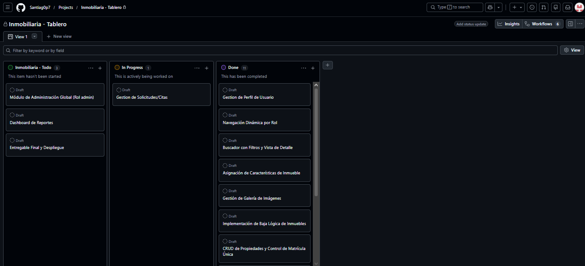

# Planificación Sprint 3 - Interacción, Administración y Cierre

- **Metodología:** Scrum
- **Duración:** 7 días
- **Estado:** 🔄 EN PROCESO
- **Objetivo del Sprint:** Completar los módulos interactivos del sistema: agendamiento y gestión de citas/solicitudes de visita (N:M), panel de administración global de usuarios y tablas paramétricas, métricas/reportes del sistema y el empaquetado final del proyecto (`proyecto_completo.sql` y tag Git `v1.0.0`).

---

## Roles Scrum
- **Product Owner:** Julian Barney Jaimes Rincon (Docente)
- **Scrum Master:** Jhoan Santiago Garcia Estupiñan
- **Development Team:** Jhoan Santiago Garcia Estupiñan

---

## Resumen del Sprint Backlog

| ID | Historia de Usuario | Épica | Estado |
|----|---------------------|-------|--------|
| HU-11 | Sistema de Agendamiento y Citas/Solicitudes de Visita | Interacción Cliente | 🔄 EN PROCESO |
| HU-12 | Gestión de Solicitudes y Cambio de Estados | Interacción Inmobiliaria | 🔄 EN PROCESO |
| HU-13 | Panel de Administración Global de Usuarios y Roles | Administración | 🔄 EN PROCESO |
| HU-14 | Mantenimiento de Tablas Paramétricas | Administración | 🔄 EN PROCESO |
| HU-15 | Métricas del Dashboard, Consolidado SQL y Tag `v1.0.0` | Cierre de Proyecto | 🔄 EN PROCESO |

**Leyenda:** ✅ COMPLETADO · 🔄 EN PROCESO (código implementado, en validación/pruebas) · ⏳ PENDIENTE

---

## Historias de Usuario Seleccionadas (Sprint Backlog)

### HU-11: Sistema de Agendamiento y Citas/Solicitudes de Visita (Cliente)
- **Como:** Cliente
- **Quiero:** Solicitar una visita a una propiedad indicando fecha, hora y comentario.
- **Criterios de Aceptación (DoD):**
  - [x] Formulario de agendamiento en la ficha de detalle de la propiedad.
  - [x] Registro de la solicitud en la tabla `solicitud_visita` con estado inicial `PENDIENTE`.
  - [x] Validación de fecha no anterior al día actual y de hora válida.
  - [x] Recorte del comentario a un máximo de 500 caracteres.
  - [x] Listado de "Mis Citas/Solicitudes" para el cliente.
  - [ ] Pruebas integrales de agendamiento y validación de bordes.
- **Tareas técnicas:**
  - [x] `SolicitudVisitaDAO.crearSolicitud(...)` con `PreparedStatement`.
  - [x] `SolicitudServlet.doPost(...)` (exclusivo del rol `CLIENTE`).
  - [x] Vista `dashboard/cliente/mis_solicitudes_cliente.jsp`.
  - [ ] Evidencia E2E (captura de una solicitud creada y listada).

### HU-12: Gestión de Solicitudes y Cambio de Estados (Inmobiliaria/Agente)
- **Como:** Inmobiliaria / Agente
- **Quiero:** Revisar las solicitudes recibidas y cambiar su estado.
- **Criterios de Aceptación (DoD):**
  - [x] Listado de solicitudes de las propiedades de la inmobiliaria en sesión.
  - [x] Flujo de estados `PENDIENTE → CONFIRMADA → REALIZADA` y `CANCELADA`.
  - [x] Validación de que solo la inmobiliaria dueña modifique sus solicitudes.
  - [x] El cliente únicamente puede CANCELAR sus propias solicitudes.
  - [ ] Pruebas integrales del flujo de estados y control de permisos.
- **Tareas técnicas:**
  - [x] `SolicitudVisitaDAO.listarPorInmobiliaria(...)` y `cambiarEstado(...)`.
  - [x] Acción `action=updateStatus` en `SolicitudServlet.doGet(...)`.
  - [x] Vista `dashboard/agente/gestion_solicitudes_agente.jsp`.
- **Reglas de negocio (referencia):**
  ```
  Estados válidos: PENDIENTE | CONFIRMADA | REALIZADA | CANCELADA
  ```

### HU-13: Panel de Administración Global de Usuarios y Roles (Admin)
- **Como:** Administrador
- **Quiero:** Gestionar las cuentas de usuario, sus roles y su estado.
- **Criterios de Aceptación (DoD):**
  - [x] Listado global de usuarios con filtro opcional por rol.
  - [x] Cambio de rol de un usuario (`action=cambiarRol`).
  - [x] Bloqueo / activación de cuentas (`action=cambiarEstado`).
  - [x] Protección: el administrador no puede cambiar su propio rol ni bloquear su cuenta.
  - [ ] Pruebas integrales de permisos y auto-protección.
- **Tareas técnicas:**
  - [x] `AdminUsuarioServlet` (acceso exclusivo `ADMINISTRADOR`, mapeado a `/AdminUsuarioServlet`).
  - [x] `UsuarioDAO.listarTodos()`, `listarRoles()`, `cambiarRol(...)`, `cambiarEstadoCuenta(...)`.
  - [x] Vista `dashboard/admin/gestion_usuarios.jsp`.

### HU-14: Mantenimiento de Tablas Paramétricas (Ciudades, Tipos, Características)
- **Como:** Administrador
- **Quiero:** Crear, actualizar y eliminar los parámetros del sistema.
- **Criterios de Aceptación (DoD):**
  - [x] CRUD de ciudades (con campo `departamento`).
  - [x] CRUD de tipos de propiedad.
  - [x] CRUD de características.
  - [x] Manejo amigable de errores de nombre duplicado (`UNIQUE`) y de registros en uso (`FOREIGN KEY`).
  - [ ] Pruebas integrales de integridad referencial.
- **Tareas técnicas:**
  - [x] `AdminParametrosServlet` (parámetros `entidad`, `operacion`, `id`, `nombre`, `departamento`).
  - [x] `CiudadDAO`, `TipoPropiedadDAO`, `CaracteristicaDAO` (operaciones `insertar`/`actualizar`/`eliminar`).
  - [x] Vista `dashboard/admin/gestion_parametros.jsp` (pestañas: ciudades, tipos, características).
  - [x] Script `db/sprints/sprint3_item2.sql` (columna `departamento` en `ciudad`).

### HU-15: Métricas del Dashboard, Consolidado SQL Final y Tag Git v1.0.0
- **Como:** Administrador / Equipo de desarrollo
- **Quiero:** Visualizar métricas del sistema, disponer de un único script SQL y cerrar la versión.
- **Tareas técnicas (estado real):**
  - [x] Módulo de reportes con las consultas obligatorias.
    - `ReporteServlet` + `ReporteDAO` + `dashboard/admin/reportes.jsp`.
    - INNER JOIN de 4 tablas, LEFT JOIN (propiedades sin imágenes) y GROUP BY + HAVING (ciudades con 2+ propiedades).
  - [x] Métricas/resumen en los dashboards con tarjetas dinámicas de contadores reales.
    - `DashboardServlet` (mapeado a `/DashboardServlet`) inyecta las métricas por rol.
    - `ReporteDAO`: `totalPropiedadesActivas()`, `totalSolicitudesPendientes()`, `totalUsuarios()`, `obtenerMetricasPorCiudad()`, `obtenerMetricasPorTipo()`.
    - Vistas `dashboard/admin/index.jsp` y `dashboard/agente/index.jsp`.
  - [x] Consolidado SQL final `db/proyecto_completo.sql` (unificación de `sprint1.sql` + `sprint2.sql` + `sprint3.sql` + `sprint3_item2.sql` + datos de demo).
  - [x] Verificación de instalación desde cero (base de datos limpia → ejecución de `proyecto_completo.sql`).
  - [ ] Tag Git `v1.0.0` y cierre del repositorio.
- **Consulta de referencia (GROUP BY + HAVING ya implementada):**
  ```sql
  SELECT c.nombre AS nombre_ciudad, COUNT(p.id_propiedad) AS total
  FROM ciudad c
  INNER JOIN propiedad p ON c.id_ciudad = p.id_ciudad
  WHERE p.estado_logico = TRUE
  GROUP BY c.id_ciudad, c.nombre
  HAVING COUNT(p.id_propiedad) >= 2
  ORDER BY total DESC, c.nombre ASC;
  ```

---

## Estado de Avance de los Módulos

| Módulo | Artefacto principal | Estado |
|--------|---------------------|--------|
| Citas / Solicitudes | `SolicitudServlet`, `SolicitudVisitaDAO` | 🔄 Implementado, en pruebas |
| Administración de Usuarios | `AdminUsuarioServlet`, `UsuarioDAO` | 🔄 Implementado, en pruebas |
| Parámetros del Sistema | `AdminParametrosServlet`, `CiudadDAO`, `TipoPropiedadDAO`, `CaracteristicaDAO` | 🔄 Implementado, en pruebas |
| Reportes | `ReporteServlet`, `ReporteDAO`, `reportes.jsp` | ✅ Completado |
| Métricas de Dashboard | `DashboardServlet`, `ReporteDAO`, dashboards admin/agente | ✅ Completado |
| Consolidado SQL | `db/proyecto_completo.sql` | ✅ Completado |
| Cierre de versión | Tag Git `v1.0.0` | ⏳ Pendiente |

---

## Definition of Done (DoD) para el Cierre del Proyecto

- [ ] Las 15 historias de usuario (HU-01 a HU-15) cumplen el 100% de sus criterios de aceptación.
- [ ] Los tres roles (`ADMINISTRADOR`, `INMOBILIARIA`, `CLIENTE`) operan de extremo a extremo sin errores.
- [ ] Todos los módulos interactivos (citas, administración y parámetros) superan las pruebas de integración.
- [ ] El consolidado `db/proyecto_completo.sql` levanta el sistema desde una base de datos vacía.
- [ ] El `README.md` documenta requisitos, despliegue, credenciales de prueba y arquitectura.
- [ ] El código compila y se despliega en Apache Tomcat sin advertencias críticas.
- [ ] No existe acceso directo a datos sin `PreparedStatement` ni rutas `dashboard/*` sin `AuthFilter`.
- [ ] Los scripts SQL y los datos semilla son idempotentes y reproducibles.
- [ ] Se generan las evidencias (capturas) de cada módulo para la entrega final.
- [ ] El repositorio queda etiquetado con el tag `v1.0.0` y el historial de commits está limpio.

---

## Evidencia del Tablero Kanban


---

## Sprint Review (Sprint 3)

- **Incremento demostrado:** sistema de citas/solicitudes de visita, módulo de
  solicitudes de compra/arriendo con radicación y aprobación de documentos, panel de
  administración (usuarios, roles y parámetros), favoritos, reportes con consultas de
  agregación, métricas del dashboard y despliegue en línea (Render + Clever Cloud).
- **Historias aceptadas:** HU-11 a HU-15 (incluidas favoritos y reportes adicionales).
- **Criterios de aceptación:** cumplidos; control de acceso validado en servidor y
  captura de errores UNIQUE con mensajes amigables.
- **Feedback del Product Owner:** cerrar la documentación (MER, modelo relacional,
  diccionario de datos y casos de uso) y preparar la sustentación.

## Sprint Retrospective (Sprint 3)

- **Qué funcionó bien:** la integración continua con Git y el despliegue con Docker/Render.
- **Qué mejorar:** verificar compatibilidad de sintaxis SQL entre MySQL y MariaDB y
  depurar los scripts del repositorio.
- **Acciones de cierre:** versionar la entrega (`v1.0.0`), consolidar la documentación
  y ensayar la sustentación del modelo de datos.

